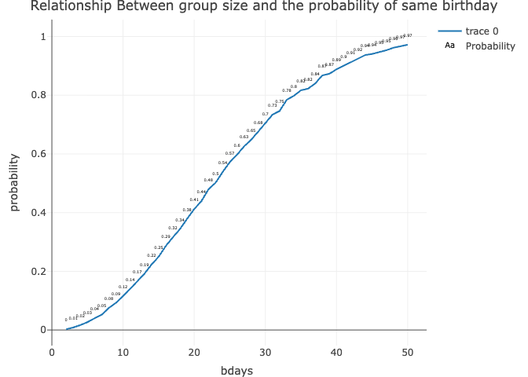

p8105_hw5_hc3654.Rmd
================

``` r
library(tidyverse)
```

    ## ── Attaching core tidyverse packages ──────────────────────── tidyverse 2.0.0 ──
    ## ✔ dplyr     1.1.4     ✔ readr     2.1.5
    ## ✔ forcats   1.0.0     ✔ stringr   1.5.1
    ## ✔ ggplot2   3.5.2     ✔ tibble    3.3.0
    ## ✔ lubridate 1.9.4     ✔ tidyr     1.3.1
    ## ✔ purrr     1.1.0     
    ## ── Conflicts ────────────────────────────────────────── tidyverse_conflicts() ──
    ## ✖ dplyr::filter() masks stats::filter()
    ## ✖ dplyr::lag()    masks stats::lag()
    ## ℹ Use the conflicted package (<http://conflicted.r-lib.org/>) to force all conflicts to become errors

``` r
library(plotly)
```

    ## 
    ## Attaching package: 'plotly'
    ## 
    ## The following object is masked from 'package:ggplot2':
    ## 
    ##     last_plot
    ## 
    ## The following object is masked from 'package:stats':
    ## 
    ##     filter
    ## 
    ## The following object is masked from 'package:graphics':
    ## 
    ##     layout

``` r
library(broom)
library(webshot2)
```

# Problem 1

## Function

``` r
set.seed(1)

bd_dupchecks = function(n_subj){
birthday = sample(1:365, n_subj, replace = TRUE)

check = length(unique(birthday)) < n_subj

check
}

bd_results_df = 
  expand_grid(bdays = 2:50, iter = 1:10000) |> 
  mutate(duplicate = map(bdays, bd_dupchecks)) |> 
  unnest(duplicate)
  
bd_results_df |>
  group_by(bdays) |> 
  summarise(probability = mean(duplicate)) |> 
  plot_ly( x = ~bdays, y = ~probability, type = "scatter", mode = "lines") |> 
  add_text(y = ~probability + 0.03,text = ~round(probability, 2),textfont = list(size = 5, color = 'black'),name = "Probability") |> 
  layout(title = "Relationship Between group size and the probability of same birthday")
```

    ## file:////private/var/folders/2g/_02lpj050qgd8z_h4zzdwwpw0000gn/T/RtmpivEoMK/file194c5389647d/widget194c61247563.html screenshot completed

<!-- -->

The plot shows the probability of at least two people sharing a birthday
as a function of the group size. The relationship is non-linear and
increases rapidly. The probability from 0.0024 while group size is 2,
crosses 50% when the group size is 23, and by the time the group size
reaches 50, the probability of a shared birthday is approximately 97.0%.

# Problem 2

``` r
set.seed(1)
t_test = function(n = 30, mu = 0 , sigma = 5){
 df = rnorm(n, mu, sigma) 

  test_result = t.test(df, mu = 0)
  result_df = broom::tidy(test_result) |> 
    select(estimate, p.value)
  
  Reject = result_df$p.value < 0.05
  result =tibble(Reject, estimate = result_df$estimate)
  
  return(result)
}

estimate_df <- 
expand_grid(
  mu = c(0,1,2,3,4,5,6),
  iter = 1:5000) |> 
  mutate(estimate = map(mu, ~ t_test(n = 30, mu = .x, sigma = 5))) |> 
  unnest(estimate) 
  
avg_estimate_all <- 
  estimate_df |> 
  group_by(mu) |> 
  summarise(avg_estimate_all = mean(estimate),
    rejected_prop= mean(Reject))


avg_estimate_reject <- 
estimate_df |> 
  filter(Reject == TRUE) |> 
  group_by(mu) |> 
  summarise(avg_estimate_reject = mean(estimate))

avg_estimate <- 
  left_join(avg_estimate_all,avg_estimate_reject)
```

    ## Joining with `by = join_by(mu)`

``` r
#Make a plot showing the proportion of times the null was rejected (the power of the test) on the y axis and the true value of 𝜇on the x axis. Describe the association between effect size and power.

avg_estimate |> 
  plot_ly(y = ~rejected_prop, x = ~mu, type = 'scatter', mode = "lines") |> 
  layout(xaxis = list(title = "True Mean"), yaxis = list(title = "Rejected Proportion")) |> 
  add_text(y = ~rejected_prop + 0.06, text = ~paste0(round(rejected_prop * 100, 1), "%"), textposition = "top center") |> 
  layout(title = "Relationship between Rejected Proportion and Their True Mean" )
```

    ## file:////private/var/folders/2g/_02lpj050qgd8z_h4zzdwwpw0000gn/T/RtmpivEoMK/file194c61074381/widget194c23e0fbeb.html screenshot completed

<!-- -->

The association between effect size and power is positive; in other
words, a larger true $\mu$ increases the proportion of times the null
hypothesis ($H_0: \mu = 0$) is rejected. When the true $\mu = 0$, the
hypothesis was rejected in only 5.1% of simulations. In contrast, when
$\mu$ was 5 or 6, all 5,000 simulations for each of these values
resulted in the t-test rejecting $H_0$.

``` r
#Make a plot showing the average estimate of 𝜇̂ on the y axis and the true value of 𝜇on the x axis. Make a second plot (or overlay on the first) the average estimate of 𝜇̂ only in samples for which the null was rejected on the y axis and the true value of 𝜇on the x axis. Is the sample average of 𝜇̂ across tests for which the null is rejected approximately equal to the true value of 𝜇? Why or why not?


new_avg_estimate <- avg_estimate |> 
  pivot_longer(
    cols = starts_with("avg_estimate_"),
    names_to = "avg_estimate",
    names_prefix = "avg_estimate_",
    values_to = "avg_mu_hat"
  ) 


new_avg_estimate |> 
  plot_ly( y = ~avg_mu_hat, x = ~mu, color = ~avg_estimate, type = 'scatter', mode = 'lines+markers') |> 
  add_text(y = ~ifelse(avg_estimate == "all", 
                avg_mu_hat - 0.50,  
                avg_mu_hat + 0.25), text = ~round(avg_mu_hat, 3),textposition = 'top center',textfont = list(size = 10),showlegend = FALSE
  ) |>
  layout(title = "Relationship Between Average value of Mu hat and True Mean", xaxis = list(title = 'True Mean'), yaxis = list(title = 'Average value of Mu hat'))
```

    ## file:////private/var/folders/2g/_02lpj050qgd8z_h4zzdwwpw0000gn/T/RtmpivEoMK/file194c436d5fbb/widget194c41a81092.html screenshot completed

<!-- -->

Across all tests, the average estimate of $\hat{\mu}$ is approximately
equal to the true value of $\mu$, confirming it is an unbiased
estimator. However, the average $\hat{\mu}$ from only those samples for
which the null was rejected is systematically higher than the true
$\mu$, particularly at smaller effect sizes such as
$\mu = 1, 2, \text{ and } 3$. This is caused by selection bias. The
t-test ($H_0: \mu = 0$) only “rejects” samples when their $\hat{\mu}$ is
surprisingly far from 0. When the true $\mu$ is small (e.g., $\mu = 2$),
only the samples that, by random chance, overestimate the mean (e.g.,
$\hat{\mu} = 2.8$) are far enough from 0 to be rejected. By filtering
for only this “rejected” group, we are looking at a biased subgroup that
systematically overestimates the true $\mu$. This bias disappears as
$\mu$ becomes large because the power (rejection rate) approaches 100%,
meaning all samples are included in the “rejected” group.

# Problem 3

``` r
raw_data2 <- read_csv("https://raw.githubusercontent.com/washingtonpost/data-homicides/refs/heads/master/homicide-data.csv")
```

    ## Rows: 52179 Columns: 12
    ## ── Column specification ────────────────────────────────────────────────────────
    ## Delimiter: ","
    ## chr (9): uid, victim_last, victim_first, victim_race, victim_age, victim_sex...
    ## dbl (3): reported_date, lat, lon
    ## 
    ## ℹ Use `spec()` to retrieve the full column specification for this data.
    ## ℹ Specify the column types or set `show_col_types = FALSE` to quiet this message.

The raw data (raw_data2) is a large tibble containing 52,179
observations, where each row represents a single homicide victim. The
columns include a unique uid for the case, the victim’s name, race, age,
and sex, the date the incident was reported, the location (city, state),
and the disposition of the case (e.g., “Closed with arrest”, “Open/No
arrest”). The disposition column is critical for determining if a case
is unsolved.

``` r
city_state_df <- 
raw_data2 |> 
  unite(city_state, city, state, sep = ', ')|> 
  select(city_state, uid, disposition) |> 
  group_by(city_state) |> 
  summarise(homicides_total = n(), homicides_unsolved = sum(disposition == "Closed without arrest" | disposition == "Open/No arrest")) |> 
  mutate(prop_unsolved = homicides_unsolved / homicides_total)

city_ci = function(place){
city_state_df |> 
  filter(city_state == place) |> 
  with(prop.test(x = homicides_unsolved, n = homicides_total)) |> 
  broom::tidy() |> 
  select(estimate, conf.low , conf.high) |> 
  mutate(city_state = place) |> 
  janitor::clean_names()
}
```

``` r
city_ci("Boston, MA")
```

    ## # A tibble: 1 × 4
    ##   estimate conf_low conf_high city_state
    ##      <dbl>    <dbl>     <dbl> <chr>     
    ## 1    0.505    0.465     0.545 Boston, MA

``` r
city_ci_df = map_dfr(city_state_df$city_state, city_ci)|> 
arrange(desc(estimate))
```

    ## Warning in prop.test(x = homicides_unsolved, n = homicides_total): Chi-squared
    ## approximation may be incorrect

``` r
city_ci_df 
```

    ## # A tibble: 51 × 4
    ##    estimate conf_low conf_high city_state        
    ##       <dbl>    <dbl>     <dbl> <chr>             
    ##  1    0.736    0.724     0.747 Chicago, IL       
    ##  2    0.649    0.623     0.673 New Orleans, LA   
    ##  3    0.646    0.628     0.663 Baltimore, MD     
    ##  4    0.618    0.558     0.675 San Bernardino, CA
    ##  5    0.612    0.569     0.654 Buffalo, NY       
    ##  6    0.605    0.569     0.640 Miami, FL         
    ##  7    0.599    0.552     0.645 Stockton, CA      
    ##  8    0.588    0.569     0.608 Detroit, MI       
    ##  9    0.551    0.518     0.584 Phoenix, AZ       
    ## 10    0.542    0.485     0.598 Denver, CO        
    ## # ℹ 41 more rows

``` r
plot_data <- city_ci_df  |>
  mutate(
    city_state = fct_reorder(city_state, estimate)
  )


plot_ly(plot_data,height = 1400) |>
  add_segments(
    x = ~conf_low, 
    xend = ~conf_high,
    y = ~city_state, 
    yend = ~city_state,
    color = I("gray"),
    name = "95% CI"
  ) |>
    add_markers(
    x = ~estimate, 
    y = ~city_state,
    color = I("darkblue"),
    name = "Estimate"
  ) |>
  layout(
    title = "Relationship Between City and Their Unsolved Homicides cases (with 95% CI)",
    xaxis = list(title = "Estimated Proportion Unsolved"),
    yaxis = list(title = "City")
  )
```

    ## file:////private/var/folders/2g/_02lpj050qgd8z_h4zzdwwpw0000gn/T/RtmpivEoMK/file194c7d821ac7/widget194c68ac3f30.html screenshot completed

<!-- -->

This plot shows the estimated proportion of unsolved homicides for all
50 cities. The city with the highest proportion is clearly Chicago, IL.

Conversely, the lowest proportion technically belongs to Tulsa, AL.
However, upon inspecting the data, this estimate is based on only one
total homicide case, making it an unreliable outlier.

Excluding this outlier, Richmond, VA has the lowest proportion of
unsolved homicide cases among the cities in this dataset.
